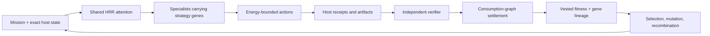

# AMOS Organism

AMOS Organism is the governed learning architecture intended to become the
intelligence backbone of AMOS Hosted. Qwen (and later other compatible models)
provides general cognition; the organism accumulates reusable procedures that
survive independent verification.

This repository begins at the smallest defensible organism boundary:

- **Energy** is mission-scoped permission to spend compute and tools.
- **Fitness** is cross-mission, clawbackable credit that vests only after a
  host-attested consumption path reaches the official verifier.
- **Strategy genes** are immutable, content-addressed procedures with lineage.
- **Reputation** is a contextual view of vested fitness, not a currency.
- **Novelty** protects a small archive slot; it never grants energy or fitness.
- **Trust and authority** remain host-owned constraints outside the organism.
- **HRR/semantic state** guides attention but can never become evidence.

The model may propose work. It cannot mint receipts, fitness, genes, evidence,
or authority.

## The loop



An AMOS procedure has crossed the organism threshold when it vests on one
mission, is reused on a new mission without changing model weights, and earns
fitness again. A procedure that was merely produced—but never consumed—cannot
buy its own survival.

## What is implemented

- Mission energy allocation, reservation, spending, refund, and reset.
- Provisional fitness escrow, verifier-gated vesting, decay/clawback, and
  contextual reputation views.
- Host-attested causal graphs using conservative consumption/citation credit.
- Content-addressed strategy genes with mutation/recombination parents,
  rights/contamination tags, verified outcomes, and novelty retention.
- Context-keyed pheromones that preserve signal type instead of collapsing to a
  global attract/repel scalar.
- A dual-channel world-state boundary: exact host facts versus non-authoritative
  HRR attention and typed transition predictions.
- A value-of-computation policy based only on vested improvement, with quality
  lexicographically ahead of speed.

See [First Principles](docs/FIRST_PRINCIPLES.md),
[Model Manifest](docs/MODEL_MANIFEST.md), and [Roadmap](docs/ROADMAP.md).

## Development

Requires Node.js 22.18 or newer.

```bash
npm install
npm run check
```

## Status

Research-stage kernel. It does not yet serve inference, replace the external
AMOS verifier, train adapters, or make production decisions. Those boundaries
are deliberate.

## License

Apache-2.0.
