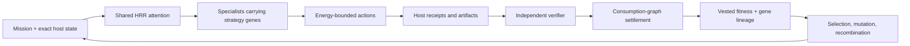

# AMOS Organism

AMOS Organism is the governed learning architecture intended to become the
intelligence backbone of AMOS Hosted. Qwen (and later other compatible models)
provides general cognition; the organism accumulates reusable procedures that
survive independent verification.

This repository begins at the smallest defensible organism boundary:

- **Energy** is mission-scoped permission to spend compute and tools.
- **Fitness** is cross-mission, clawbackable credit that vests only after a
  host-attested consumption path reaches the official verifier.
- **Strategy genes** are immutable, content-addressed procedures with lineage.
- **Reputation** is a contextual view of vested fitness, not a currency.
- **Novelty** protects a small archive slot; it never grants energy or fitness.
- **Trust and authority** remain host-owned constraints outside the organism.
- **HRR/semantic state** guides attention but can never become evidence.

The model may propose work. It cannot mint receipts, fitness, genes, evidence,
or authority.

## The loop



An AMOS procedure has crossed the organism threshold when it vests on one
mission, is reused on a new mission without changing model weights, and earns
fitness again. A procedure that was merely produced—but never consumed—cannot
buy its own survival.

## What is implemented

- Mission energy allocation, reservation, spending, refund, and reset.
- Provisional fitness escrow, verifier-gated vesting, decay/clawback, and
  contextual reputation views.
- Host-attested causal graphs using conservative consumption/citation credit.
- Content-addressed strategy genes with mutation/recombination parents,
  rights/contamination tags, verified outcomes, and novelty retention.
- Context-keyed pheromones that preserve signal type instead of collapsing to a
  global attract/repel scalar.
- A dual-channel world-state boundary: exact host facts versus non-authoritative
  HRR attention and typed transition predictions.
- A value-of-computation policy based only on vested improvement, with quality
  lexicographically ahead of speed.
- A durable, append-only JSONL event chain plus a host-gated AMOS/AWS trace
  intake boundary. Failed or ineligible runs become zero-fitness negative
  experience; verified procedures remain candidates until separately approved.
- Deterministic replay of fitness escrow, settlement, regression punishment,
  candidate lineage/promotion, admitted genes, host-attested expressions, and
  verifier outcomes, so neither reward nor punishment disappears on restart.
- Versioned canonical contracts under `contracts/` for candidates,
  expressions, trace bundles, and consent-gated Platform Mission episodes.
- Contextual gene selection and a host `gene-expressed` receipt. A model cannot
  self-report which procedure deserves credit.
- Research-only mutation/recombination proposals that run without approval;
  admission, external authority, promotion, and success claims remain
  host/verifier controlled.
- Lexicographic gene selection. Genuine verified failure produces negative
  guidance; successful but unconsumed work is recorded separately as
  `uncredited` and cannot poison a procedure.
- Three initial strategy genes extracted and separately admitted from verified,
  AMOS-owned Qwen swarm traces: bounded provider recovery, typed-tool recovery,
  and lossless context compaction.

See [First Principles](docs/FIRST_PRINCIPLES.md),
[Model Manifest](docs/MODEL_MANIFEST.md), and [Roadmap](docs/ROADMAP.md).

## The swarm experiment

The Qwen swarm self-learning experiment that produces the organism's traces now
lives in this repository under [`swarm/`](swarm/README.md): the holographic
swarm kernel, the organism metabolism simulator, the Harbor agents, the frozen
benchmark fixtures and recorded results, the AWS research plane (Terraform,
trainer, adapter verifier, runner), and the program documents under
[`docs/swarm/`](docs/swarm/RECURSIVE_INTELLIGENCE_PROGRAM.md). The swarm imports
the kernel's contracts and digest; `npm run check` exercises both.

## Development

Requires Node.js 22.18 or newer. Development and CI are pinned to Node 24;
`npm install` fails closed on unsupported runtimes because Node 20 cannot execute
the repository's type-stripped TypeScript tests.

```bash
npm install
npm run check        # kernel typecheck + swarm syntax check + all tests
npm run test:swarm   # swarm suites only
```

Research trace bundles can be settled without trusting model-authored status:

```bash
node scripts/importTraceBundle.ts INPUT.json OUTPUT.jsonl
```

## Status

Research-stage kernel. The first metabolism loop now exists, including
canonical consent-gated Platform Mission episode intake after host/KMS
attestation, but it has not yet
demonstrated repeatable quality improvement on frozen holdouts. It does not
replace the external AMOS verifier, train adapters, or make production
decisions. Those boundaries are deliberate.

## License

Apache-2.0.
